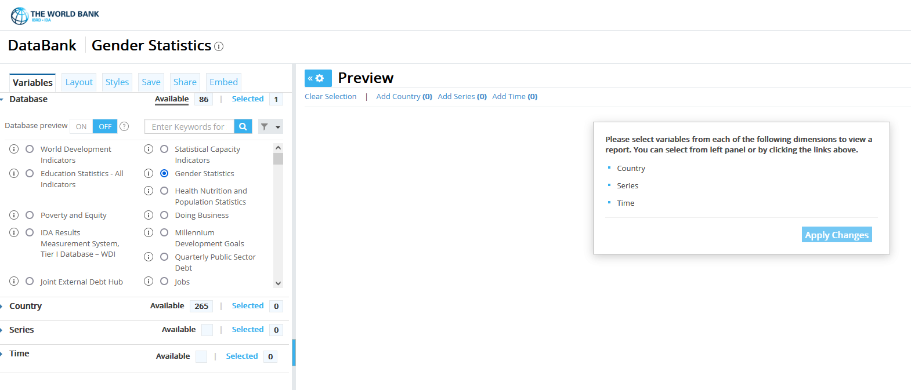

# Data Analysis Assignment 1

_Data Assignment 1 is due by 11:00 PM on Septmeber 23. You can submit your finished assignment [here](https://www.gradescope.com/courses/853960/assignments/4904592/)._

## Overview

In this assignment, you will be asked to analyze cross-country data on outcomes related to women's empowerment and wellbeing.  You 
are going to choose two variables from the [World Development Indicators (WDI) database](https://databank.worldbank.org/source/world-development-indicators); 
your task is to examine the relationship between them and present your findings in a clear and compelling way.  

There are two basic approaches to this assignment.  One approach is to consider the association between a measure of economic or social development (e.g. GDP per capita or the adult literacy rate) and an outcome related to women's participation in the economy (e.g. maternal mortality or take-up of modern contraception).  The other approach is to examine the empirical relationship between two gender-focused outcomes (e.g. the gender gap in primary school enrollment and the extent to which women's rights are legally protected).  

There is no expectation that you uncover a causal relationship; your analysis can be purely descriptive.  That said, you may want to motivate your analysis with some plausible causal story; for example with a hypothesis that you might want to test (does economic development lead to gender equality?).  Whether or not you choose to do this, you will want to think carefully about which of your two outcomes should serve as the dependent variable.

## Getting Your Data

The first step is to choose your variables from the 
World Bank's [World Development Indicators (WDI) database](https://databank.worldbank.org/source/world-development-indicators).  You can explore the 
variables in the WDI by clicking on the `Database` tab on the left side of the WDI webpage, choosing the database that you want to explore, and 
then clicking on the `Series` tab to see a list of available variables (see image below).  I recommend that you focus on the `World Development Indicators` and `Gender Statistics` databases (which you can choose on the `Database` tab).

Once you've chosen a particular variable from the `Series` tab, you also need to choose the countries and years that you want.  You should select all the countries on the `Country` tab (but not the aggregates).  You may want to try a few different years:  you probably want a fairly recent year, but sometimes dats is not yet available for many countries for the most recent years.  After you've chosen a variable, a set of countries, and a year, you will be asked to `Apply Changes`.  When you do this, your data will appear on the webpage.  At that point, you will be able to see if a variable happens to be missing for most countries - in which case, you should move on to another variable.  You want to choose two variables that are available for most countires, so that your final data set contains at least 100 observations.  

Once you've selected your variables, the last step is to download your data using the `Download options` tab in the upper right.  You can download your data as an Excel file or in csv format, either of which can be read into Stata or R.  If you end up choosing variables from two different databases, you may need to download two separate spreadsheets, which you can merge together.  

## Analyzing Your Data

Once you have your data, you will use it to produce (at least) four pieces of analysis:

- A (small) table of summary statistics on your two variables (means, standard deviations, mins, maxes, and Ns)
- A figure (e.g. a histogram or kernal density plot) illustrating something about the distribution of one of the variables
- A scatter plot showing the relationship between your two variables
- A regression table formally testing the relationship presented in the scatter plot

### Summary Statistics

Your summary statistics table should list the means, standard deviations, minima, maxima, and observations counts 
for your two main variables of interest plus any additional controls that you wish to include.  It should be 
formatted nicely, and it should be self-contained and self-explanatory.  A summary statistics table provides a simple 
way for you and your readers to check for fundamental data construction errors (e.g. data that is missing for many observations, 
or a dummy variable that takes on values other than 0 and 1).

Additional guidance on making a summary statistics table is available [here](https://pjakiela.github.io/stata/summ-stats-table.html).

### Visualizing One Variable 

A histogram or a kernal density plot is a good way to summarize the distribution of a single variable.  Histograms function like 
your summary statistics table, helping you spot irregularities and coding errors, and providing insights into the structure 
of your data set.  

When you include a figure or visualization in your written work, you should be using it to make a point - to convey something 
about your data to the reader in a powerful and intuitive way.  This may or may not be something that you can do with a simple 
histogram, depending on the nature of your variables.  You might find that a histogram of one of your variables tells 
a compelling story (hey look, this measure of women's rights looks really bimodal, suggesting that countries either really 
protect women's rights or completely fail to do so).  But you might not be so lucky.  If your two outcomes of interest 
are both dummy variables, a histogram would not be very interesting.  In that case, you might choose to make a bar chart or another 
type of visualization that illustrates how one of your varies across 
[regions or income levels](https://datahelpdesk.worldbank.org/knowledgebase/articles/906519-world-bank-country-and-lending-groups).  

As you start graphing your data, it is worth thinking about what makes for a good or bad data visualization.  There are several excellent 
introductions to data visualization on the web.  One of the most important decisions you will face is how to use color.  Claus Wilke's 
[_Fundamentals of Data Visualization_](https://clauswilke.com/dataviz/index.html) has 
an accessible discussion of color that is available [here](https://clauswilke.com/dataviz/color-basics.html).

### Scatter Plots

Scatter plots are a way of illustrating the relationship between two variables.  Again, your goal with any data visualization 
is to make a specific point about your data - in this case about the relationship between your variables.  This point may be very simple 
(e.g. Y and X are positively correlated), but it is important to approach the tast of producing a graph with your message in mind.  

For your scatter plots, you may want to make a specific point by using different colors for different regions or income levels, your you may wish to 
facet your data (showing different plots for different classes of observations), or you might want to overly a linear or non-linear regression 
over the top of your scatter plot.  Which technique is appropriate will depend on the point you are trying to make.  

### Regression Analysis

Your last piece of analysis will be a linear regression of one of your variables on the other.  You should present your regression results 
in a self-contained table.  It is acceptable to show a single regression, but you may want to consider a few different specifications.  

Additional guidance on making a regression table is available [here](https://pjakiela.github.io/stata/regression-table.html).

## Presenting Your Results

Your final product for this assignment should be a 3 to 5 page pdf containing your tables and figures and a short write-up of your analysis.  Your write-up must be written in your own words, and must adhere to the guidance on the syllabus regarding the Honor Code. You 
will also submit a Stata do file or an R script that generates your results.  You can produce your write-up using word, latex, or rmarkdown - as long as 
the end result is a pdf including your tables and figures plus your discussion of your work.

You write-up should contain at least three parts.  First, an intro paragraph explaining the question you are asking, why it is important or interesting, 
and how you will attempt to answer it.  Second, a **Data** section where you provide specific details on the variables you are using.  Your description of 
your summary statistics table and your plot of one variable should appear in this section.  Finally, a **Results** or **Analysis** section where you 
present your scatter plot and your regression analysis.

In grading your assignments, I will be looking for five things:

1. How interesting and well-motivated is your analysis?
2. Did you provide easy-to-read, well-commented code that generates your results?
3. How good are your tables and figures?  
4. How well have you explained your analysis in your write-up?
5. Have your presented your results in an elegant and easy-to-read format?

## Additional Resources

[Williams Econ Stata Tutorial Videos](https://pjakiela.github.io/stata/)

[Stata Cheat Sheets](https://www.stata.com/bookstore/stata-cheat-sheets/)

[RStudio Cheat Sheets](https://www.rstudio.com/resources/cheatsheets/)

[R for Data Science](https://r4ds.had.co.nz/)

